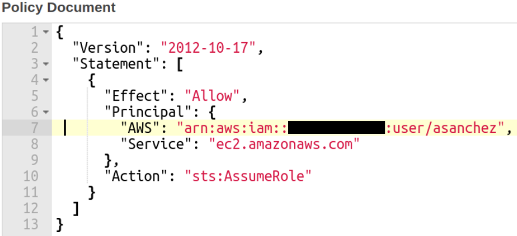

## Objective:

This README file showcases a guide for a Stretch robot utilizing [Amazon Kinesis Video Streams](https://docs.aws.amazon.com/kinesisvideostreams/latest/dg/what-is-kinesis-video.html), and [Amazon Kinesis Video Streams with WebRTC](https://docs.aws.amazon.com/kinesisvideostreams-webrtc-dg/latest/devguide/what-is-kvswebrtc.html). The robot's image ROS-topic is converted to an RTSP stream using the [ROS-RTSP ROS-package](https://github.com/CircusMonkey/ros_rtsp). This work is based off Amazon's [AWS KVS workshop](https://github.com/aws-samples/robot-camera-streaming-demo-with-aws-kvswebrtc-kvs).


## Setup
Have an Ubuntu 18.04 machine with ROS Melodic installed and AWS credential setup as env variables on the local machine. Specifically
* AWS_REGION
* AWS_ACCESS_KEY_ID
* AWS_SECRET_ACCESS_KEY
* AWS_SESSION_TOKEN (optional)


### Create kinesis video role.

Create a role with 'AmazonKinesisVideoStremsFullAccess' managed policy as shown in the image below. Name the role as `ec2_kinesis_video_role`


Edit the trust relationship by clicking the 'Trust relationships' tab under the Summary page of your role. Then click on the "Edit trust relationship" button to make the appropriate changes in the policy document. In the document, there is the Principal attribute and it indicates which other principals can assume the IAM role.  Here you include the AWS account number and user name. This is illustrated in line 7 in the image below. A user can modify the policy document for multiple principals allowing other accounts to assume the role.



## Application setup

Clone this [repository](https://github.com/hello-robot/robot-camera-streaming-demo-with-aws-kvswebrtc-kvs.git) provided in this workshop onto the development environment, preferably under /home/hello-robot/catkin_ws/src/

```
cd /home/hello-robot/catkin_ws/src
git clone https://github.com/hello-robot/robot-camera-streaming-demo-with-aws-kvswebrtc-kvs.git
```

Run the following command to install corresponding [libararies, software](setup_with_sudo.bash) and the [robot and kvs applications](user_scripts/setup_as_user.bash)
```
cd robot-camera-streaming-demo-with-aws-kvswebrtc-kvs/user_scripts
sudo bash setup_with_sudo.bash; bash setup_as_user.bash
```

Once the above command is completed, change the sample application code present in the sample application source code present in your environment at the location `amazon-kinesis-video-streams-webrtc-sdk-c/samples/kvsWebRTCClientMasterGstreamerSample.c` on your environment

The code is change is shown in before and after pictures below


You can find the file with the code to copy [here](rtsp_command.txt) , with the current code as
```
                pipeline = gst_parse_launch(
                        "rtspsrc location=rtsp://0.0.0.0:8554/back short-header=TRUE ! rtph264depay ! "
                        "video/x-h264,stream-format=byte-stream,alignment=au,profile=baseline ! "
                        "appsink sync=TRUE emit-signals=TRUE name=appsink-video",
                        &error);
```

## Update ROS RTSP Configuration File

Edit the stream_setyp.yaml file to the appropriate camera topic that will be broadcasted. Simply change the source to match Stretch's camera plugin name, /camera/color/image_raw_upright_view.


## Launch Applications

### Launch ROS Application
To Open a new terminal and run the following launch file command

```
roslaunch stretch_deep_perception stretch_detect_faces.launch
```

In another terminal run the following launch file command
```
roslaunch stretch_gazebo upright_camera_view.launch
```
This should setup an rviz setup like the following .

Run the following command in another terminal to provide a real-time video feed of the Stretch robot's camera.
```
roslaunch ros_rtsp rtsp_streams.launch
```
### Set AWS credentials
Include your aws credentials (access key, secret access key, and default region) to the *creds_from_default_file_stretch()* function in the [utility_bash_function](utility_bash_functions) file.


Then in a separate terminal setup your credentials by running the following command.
```
creds_from_default_file_stretch
```


### Launch Webrtc application

Once the credentials are setup, you can setup the webrtc application by running the following *IN THE SAME TERMINAL WHERE YOU SETUP CREDENTIALS*
```
# build code again since we modified it with new gst-pipeline

echo "building webrtc code"
APP_DIRECTORY=/home/hello-robot/catkin_ws/src/robot-camera-streaming-demo-with-aws-kvswebrtc-kvs
mkdir $APP_DIRECTORY/amazon-kinesis-video-streams-webrtc-sdk-c/build
cd $APP_DIRECTORY/amazon-kinesis-video-streams-webrtc-sdk-c/build
cmake ..
make

# Set environment variable for log level
export AWS_KVS_LOG_LEVEL=3

# move to location of built code
echo "launching webrtc app"
cd $APP_DIRECTORY/amazon-kinesis-video-streams-webrtc-sdk-c/build/samples

# Create signalling channel
echo "create signalling channel, in case it doesnt exist"
aws kinesisvideo create-signaling-channel --channel-name robot_webrtc_stream
sleep 3

# Launch the application
./kvsWebrtcClientMasterGstSample robot_webrtc_stream
```

This will create a KVS webrtc connection between the robot and your browser. You can view it on the Console page by selecting the corresponding signaling channel clicking on Media playback viewer.


### Launch KVS video stream application
Setup the KVS stream from the same terminal from which you have the credentials using the following commands
```
# set env vars to recognize the kvs plugin
APP_DIRECTORY=/home/hello-robot/catkin_ws/src/robot-camera-streaming-demo-with-aws-kvswebrtc-kvs
export GST_PLUGIN_PATH=$GST_PLUGIN_PATH:$APP_DIRECTORY/amazon-kinesis-video-streams-producer-sdk-cpp/build
export LD_LIBRARY_PATH=$LD_LIBRARY_PATH:$APP_DIRECTORY/amazon-kinesis-video-streams-producer-sdk-cpp/open-source/local/lib

export AWS_KVS_LOG_LEVEL=3

# Make create stream api everytime for simplicity. It just fails if it already exists.
echo "Creating a new stream if it doesnt exist"
aws kinesisvideo create-stream --stream-name "robot_kvs_stream" --data-retention-in-hours "120"
sleep 3
echo "setting up kvs streaming"
gst-launch-1.0 -v rtspsrc location=rtsp://0.0.0.0:8554/back drop-on-latency=true use-pipeline-clock=true do-retransmission=false latency=0 ! rtph264depay ! h264parse ! kvssink stream-name="robot_kvs_stream" storage-size=512 aws-region=$AWS_REGION
```

You can then view the current and historical data that is streamed from the robot on the AWS console by selecting the corresponding video stream on the kvs page, as shown in the gif below.


All the commands for launching applications are available from this [file](user_scripts/utility_bash_functions)

## Clean up

You can kill the processes by running `Ctrl+C` on all the tabs. The webrtc process does not die untill the ROS application is killed.
